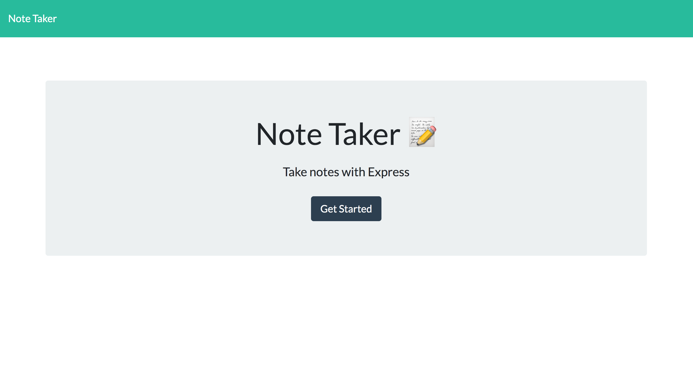

# Note Taker 

# Description

create an application called Note Taker that can be used to write and save notes. This application will use an Express.js back end and will save and retrieve note data from a JSON file.

[Link to deployable application](https://github.com/Jose8160/NoteTaker)

# Table of Contents

- [Installation](#installation)
- [Usage](#usage)
- [Contributed](#contributed)
- [License](#license)
- [Questions](#questions)

# Installation

Inquire

# Usage

Type notes to save

# Contributed

Contributers:

# License

This application is protected under conditions of the MIT license.

# Questions

My Github Profile: http://www.github.com/jose8160  
 If there are any questions contact
jose816orozco@gmail.com
